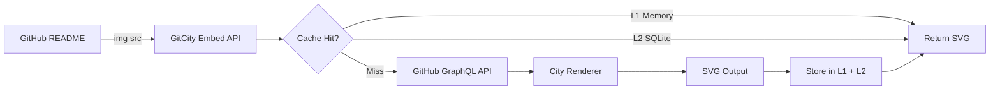

# Architecture

## Overview

GitCity Embed is a stateless SVG generation service. Each request follows a predictable pipeline:

```
Request → Rate Limit → Validate → Cache Lookup → GitHub Fetch → Render → Cache Store → Response
```

## Request Flow



## Component Diagram

```
┌─────────────────────────────────────────────────────┐
│                    Hono App                          │
│                                                     │
│  ┌──────────────┐  ┌──────────────┐                │
│  │ Cache Headers│  │  Rate Limit  │  (global middleware)
│  └──────────────┘  └──────────────┘                │
│                                                     │
│  ┌──────────┐ ┌──────────┐ ┌──────────┐ ┌───────┐ │
│  │/api/city │ │/api/card │ │/api/badge│ │ /api/ │ │
│  │          │ │          │ │          │ │leader-│ │
│  └────┬─────┘ └────┬─────┘ └────┬─────┘ │ board │ │
│       │             │             │       └───────┘ │
│  ┌────▼─────────────▼─────────────▼──────┐         │
│  │           validate middleware          │         │
│  └────────────────────┬───────────────────┘         │
│                       │                             │
│  ┌────────────────────▼───────────────────┐         │
│  │         getCachedOrFetch()             │         │
│  │  ┌──────────┐    ┌──────────────────┐  │         │
│  │  │ L1 LRU   │ → │   L2 SQLite      │  │         │
│  │  │  Memory  │    │   (persistent)   │  │         │
│  │  └──────────┘    └──────────────────┘  │         │
│  │             (cache miss)               │         │
│  │  ┌─────────────────────────────────┐   │         │
│  │  │   fetchGitHubMetrics()          │   │         │
│  │  │   + dedup() + retry + ETag      │   │         │
│  │  └─────────────────────────────────┘   │         │
│  └────────────────────────────────────────┘         │
│                                                     │
│  ┌────────────────────────────────────────┐         │
│  │          SVG Renderers                 │         │
│  │  city.ts | card.ts | badge.ts          │         │
│  │  shared: palette | shapes | layout     │         │
│  └────────────────────────────────────────┘         │
└─────────────────────────────────────────────────────┘
```

## Key Design Decisions

### No DOM, No Headless Browser
SVGs are pure string templates. Zero runtime rendering dependencies — instant cold starts.

### Two-Layer Cache
- **L1 (LRU memory):** Sub-millisecond reads for hot users. Max 500 entries, 5-minute TTL.
- **L2 (SQLite):** Survives restarts. 1-hour TTL. Stale data served on GitHub API failure.

### Deterministic Layout
Building positions use a seeded PRNG based on the username — same user always gets the same city.

### Security
- All user input validated against GitHub's username regex before any processing
- All user strings escaped before SVG embedding (no XSS via `<text>` injection)
- No `<script>`, `<foreignObject>`, or external resource refs in any SVG output
- Rate limiting per-IP and per-username with sliding windows
